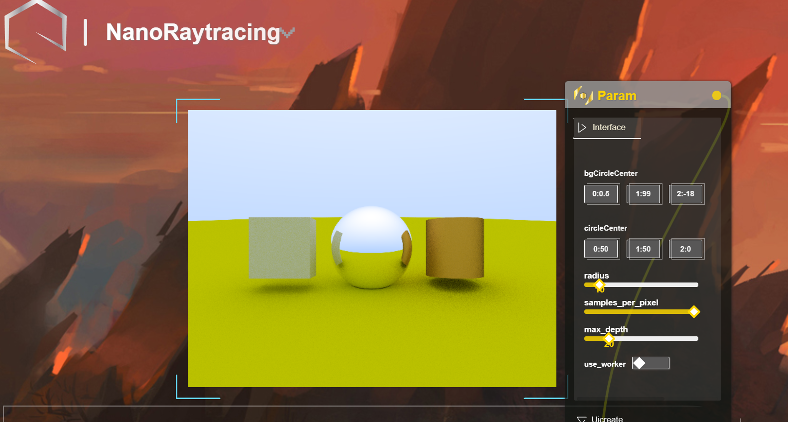

# NanoCore-Raytracing
A basic soft renderer based on typescript.

### Introduction 


**Location:**

https://haruluya.github.io/NanoCore-Raytracing


The "R" word in "nanocore world".

### Usage

```shell
git clone https://github.com/Haruluya/NanoCore-Raytracing.git
```

### Presentation


